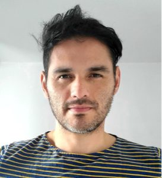

# Alejandro Granados

## Biography 
Dr Alejandro Granados is a Lecturer in Surgical Data Science at the Dept of Surgical & Interventional Engineering at King’s College London, UK. He did his PhD in Simulation and Modelling for Medicine and Surgery at Imperial College London (ICL) and has taken post-doctoral positions at ICL, UCL, and KCL. His goal is to improve surgery from a data perspective by increasing the predictive and prescriptive capabilities of patient-specific cases in the reduction of surgical complications using innovation and technology. His main research topics include the use of AI for surgical phase and action recognition, the use of multiple modalities in surgical interventions, the reduction of surgical complications, predicting brain shift, and modelling patient perspectives towards surgery. His research expertise is the result of working in multidisciplinary and diverse biomedical engineering-related projects looking at different types of data before, during, and after surgical interventions. His research has resulted not only in publications in leading international conferences and high-impact factor journals but also in two patents, a commercial prototype, a software tool used at the National Hospital for Neurology and Neurosurgery (UK), international art exhibitions, patient focus groups, and numerous public engagement activities.

## Towards Open, Reproducible and Collaborative Surgical Data Science
Surgery itself is an art and an innovation. In contrast to the past improvement in the quality of surgical care due to innovations in diagnostic and therapeutic technologies, future transformation in care will be enabled by data. Although artificial intelligence has begun to revolutionise medicine, progress has been slow in surgery. Machine learning algorithms are typically static and rely on fixed inputs. However, surgery is non-stationary, techniques change, inputs are diverse, and infrastructure is poorly integrated. Open science, empowered by data and software, is today essential towards improving the reproducibility and progress in implementing and validating data-driven methodology for surgical interventions across hospitals in a collaborative manner. In this talk, we will discuss three key aspects of data science research applied to surgical interventions: openness, reproduction, and collaboration. Recent research and trends within recent strategical and regulatory frameworks will be presented to understand the challenges and opportunities ahead.

