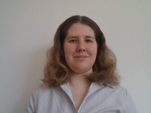

# Rachel Sparks

## Biography
Rachel Sparks, Ph.D. is a Lecturer in Surgical and Interventional Engineering at the School of Biomedical Engineering & Imaging Sciences, King’s College London since 2018. The primary focus of her research is on developing computer-assisted planning and image-guidance techniques to increase accuracy of medical diagnosis and improve safety during surgical interventions. As part of this work, she is the technical lead for EpiNav™: Epilepsy navigation, a software platform to aid in the planning of surgical interventions for the treatment of epilepsy that has been in development for over 10 years.
Her work involves building patient-specific models to provide quantitative measures of risk and efficacy related to surgical interventions, including the placement of tools, removal or treatment of tissue. Much of her research is focused on using deep learning to improve diagnosis and prognosis in brain disorders, with a focus on epilepsy. As part of her work several open-source packages including TorchIO: a deep learning medical image pre-processing toolkit (https://github.com/fepegar/torchio) and a toolkit to predict tool bending (https://github.com/agranadoseu/SEEG-Electrode-Bending) among others have been released.

## Developing a surgical planning platform for long-term sustainability: one decade worth of lessons
Focusing on my thoughts & perspectives on what you need to maintain a software platform that is used clinically long term.  

