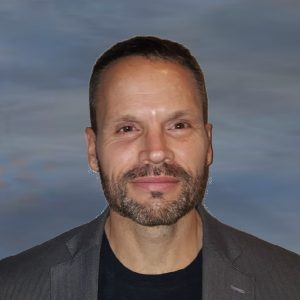

# Stephen R. Aylward

## Biography 
Stephen R. Aylward, Ph.D. is Senior Director of Strategic Initiatives at Kitware, Fellow of the MICCAI Society, and Adjunct Associate Professor of Computer Science at The University of North Carolina (UNC) at Chapel Hill. He also serves as chair of the MONAI advisory board, treasurer of the MICCAI Special Interest Group on Medical Ultrasound, and advisory board member for multiple academic, government, and industrial organizations. Prior to joining Kitware, he was a tenured professor in the Department of Radiology at UNC. His career in open source began as one of the original project leaders for the development of the Insight Toolkit (ITK). He served as a founding president of the Insight Software Consortium that managed ITK for its first 15 years. He then served as Core PI for the development and maintenance of 3D Slicer for four years. He is now active in the development and dissemination of the MONAI medical image deep learning toolkit, as chair of the MONAI advisory board. Additionally, he is PI on multiple NIH, DARPA, and DoD-funded research projects. His research is currently focused on point-of-care AI and AR/VR technologies.

## ITK, 3D Slicer, and MONAI: Creating and sustaining impact with open-source, medical imaging software

Three of the most impactful open-source medical image analysis software toolkits available today are ITK (Insight Toolkit), 3D Slicer, and MONAI (Medical Open Network for AI). These toolkits span nearly 25 years of research and development, offering traditional image analysis as well as cutting-edge deep learning methods for nearly every aspect of medical imaging. They have been downloaded millions of times, featured in thousands of publications, and used in hundreds of clinical products. This talk will review the general software, licensing, and outreach practices that have fostered their success. The concepts of Open Science will be presented as the common foundation that is driving those practices and their success. We will also discuss how open science, and the tools to achieve it, can power your own research and development efforts, reducing risk and inspiring continuous improvement. 

 
