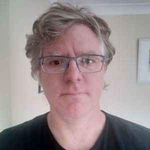

# Stephen Thompson

## Biography 
Dr. Stephen Thompson is a researcher and research software engineer working in the field of computer assisted healthcare. They began research in this field in 2006 and completed their PhD at UCL in 2010. Since then they have developed software and published research in the field of augmented reality applied to surgical interventions. They have performed research applied to minimally invasive abdominal and orthopaedic surgery.
Their principal research interest in the development of a better understanding of the interaction between computers and surgeons, to ensure that computer assisted healthcare systems result in patient benefit.
Their research is underpinned by a substantial body of open-source software, developed with the intent to support other researchers in the field and foster collaboration. They have contributed to the NifTK and PLUS open-source software platforms and are the lead developer on the SciKit-Surgery platform.

## SciKit-Surgery: Creating modular code, limiting the size of software to enable researcher participation.
The sheer size of some software libraries intended to support image guided interventions can be off putting for researchers looking to make a contribution to the code base. For large libraries and applications it can be very difficult to know where to put your code and to avoid unintended interactions with other parts of the software. When we developed SciKit-Surgery we identified 2000 lines of code as being about right for a PhD level researcher to be able to contribute to and maintain. During this talk I will look at the implications of this size limit and discuss how participants can contribute their own code.

