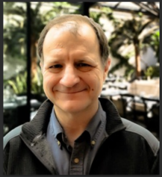

# Steve Pieper

## Biography
Steve Pieper, Ph.D. is a Computer Scientist with a passion for applying computer analysis to problems in medical imaging, surgical planning, and biomechanical simulation. His work takes the form of both entrepreneurship and academic research. Steve was a founder and worked for nearly a decade as CTO of a company that developed and sold a popular surgery planning software system for vascular surgery. Upon returning to focus on research, Steve has served as the Chief Architect of the 3D Slicer software package for over two decades with funding from NIH and other sources in collaboration with the Mass General Brigham academic hospital system, Harvard Medical School, MIT, and other organizations. Steve is also active in a variety of research collaborations related to software development, surgical applications, high performance computing, machine learning, and product development with large and small companies around the world. Steve has been active in medical imaging research and software development since obtaining his PhD from MIT in 1991 on the topic of computer-aided plastic surgery. Steve is one of the three “benevolent dictators” of the 3D Slicer community, actively working with multiple teams to support the diverse and productive ecosystem of 3D Slicer core technologies and extensions.

## 3D Slicer as your medical software development platform: Why and How
After over 20 years of intensive development in academic and commercial settings, 3D Slicer has achieved a level of functionality, maturity, and community acceptance to make it the logical choice for a wide range of academic and commercial research and development projects. In this talk we will briefly survey some of the core technical foundations that make 3D Slicer so uniquely powerful, such as its complete programmability as well its as mature support for a wide range of DICOM acquisition types, complex linear and nonlinear transforms, segmentation, visualization modes, and real-time device integrations. We will also review some of the core decisions around project management and community development and how those decisions have led to an active ecosystem that continues to maintain and improve the software through support from a network of synergistic projects. Finally we will consider some of the projects built with 3D Slicer, how they benefit from working with the 3D Slicer system and community, and how people considering new projects can learn from these examples. 

